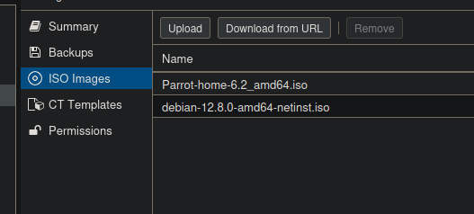
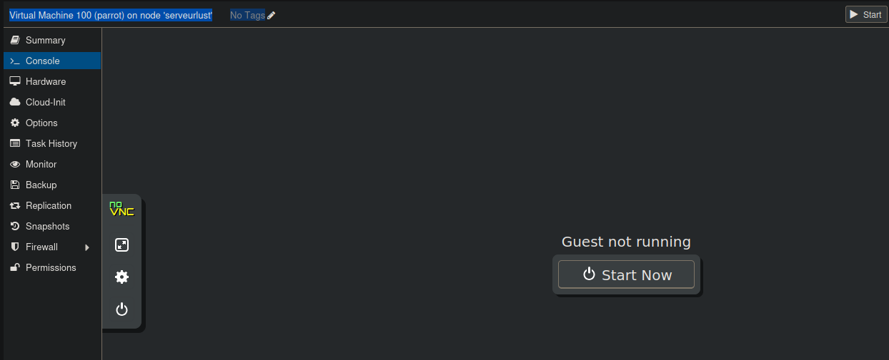

# Compte rendue

## Somaire
1. installation de Proxmox
2. mise en place de la premier VM
3. ouverture du ports 
4. Ajout utilisateur
5. Sécurisation du serveur  
    5.1. fail2ban
    5.2 sshd
---
### 1. installation de Proxmox

Sur mon serveur j'ai installé Proxmox avec une clef bootable.

J'ai rencontré 2 problèmes durant l'installation.

le premier est que je n'avais pas activé la virtualisation sur le serveur 
Donc j'ai activé la virtualisation sur le BIOS et j'ai refait une installation.  
Le 2ème problème rencontré est que le serveur ne veut pas booter sur le bon disque, donc pour booter le serveur je suis obligé de le booter avec l'option debug de ma clef bootable.

### 2. mise en place de la premier VM

dans un premier temps, j'ai ajouté des fichiers ISO sur le serveur pour mes prochaines VM



ensuite j'ai créer ma premier VM 



### 3. ouverture du ports 

Sur le panneau Admin de ma Freebox, j'ai créé une configuration pour mon serveur. J'ai ouvert le port 20457 et ma box et le redirige sur le port 8006 de mon serveur.

### 4. Ajout utilisateur

```zsh
adduser nico

usermod -aG sudo nico
```


### 5. Sécurisation du serveur

Dans un premier temps, j'ai mis à jour le serveur.
Et installer sudo.

Pour s'impliquer dans le compte rendu, je vais juste mettre les commandes que j'ai exécutées.

```zsh
apt update

apt install sudo 

root@serveurlust:~# apt install fail2ban
```

#### 5.1 fail2ban

```zsh
root@serveurlust:~# apt install fail2ban
```

```zsh
root@serveurlust:~# cp /etc/fail2ban/jail.conf /etc/fail2ban/jail.local

root@serveurlust:~# nano /etc/fail2ban/jail.local

...
[proxmox]
enabled = true
port = https,http,8006
filter = proxmox
backend = systemd
maxretry = 3
findtime = 2d
bantime = 1h
```

```zsh
root@serveurlust:~# nano /etc/fail2ban/filter.d/proxmox.conf

...
[Definition]
failregex = pvedaemon\[.*authentication failure; rhost=<HOST> user=.* msg=.*
ignoreregex =
journalmatch = _SYSTEMD_UNIT=pvedaemon.service
```

```zsh
systemctl restart fail2ban
```


### 5.2 sshd

```zsh
root@serveurlust:~# nano /etc/ssh/sshd_config

...
PermitRootLogin no
...
```